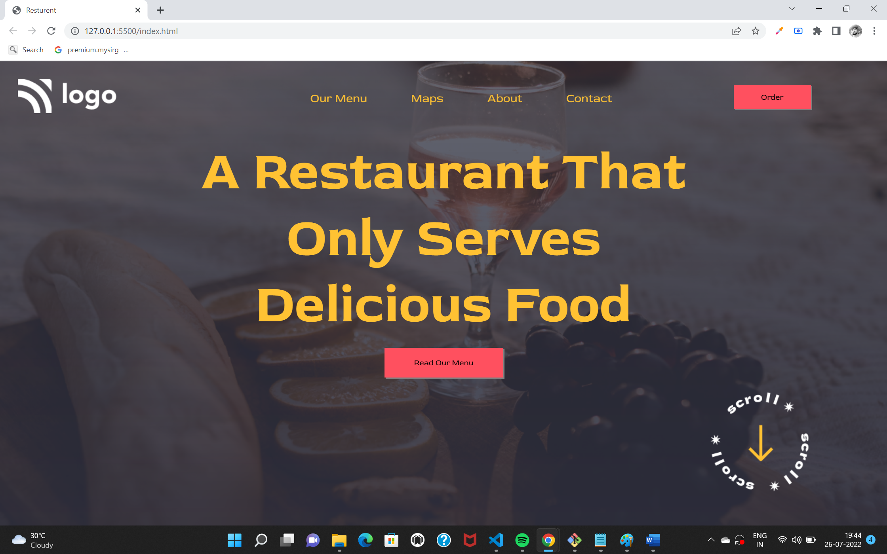

# HEY I AM ROHAN KAUSHIK 

This is the Resturant home page project which I have editted after getting more experience.

## What I have learnt in this Project
  
- I improved in second time that we should not fix every thing in pixeles it is not good practice
- I discovered how can i set properties for body background so that it will responsible for different size
- i found the way that how can a image have the layer of colour with opacity 
- first time i did this with fixed positions but while deploying it was not fit to screen thats why I again editted with flexbox

## Time Spent on this project

- I have done this project from 2 different ways when first time i did it took 4hrs but second time i spent 2hrs  

## Screenshot of my Project

> [Deployed_Link](https://62dff858169870029b2fa2e7--rohankaushikresturant.netlify.app/)